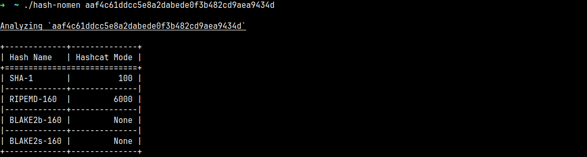

<p align="center">
  
  <h1 align="center">hash-nomen</h1>
  <p align="center">Regex-based hash type identifier</p>
</p>



## Features

- Built with **Rust** for a **fast and lightweight** experience
- Automatically **identifies hash types** using configurable **regex patterns**
- Includes corresponding **Hashcat mode IDs** for supported hashes
- Uses a **client-side `.ron` configuration** for easily adding custom hash types

## Building from Source

### Prerequisites

Before building the application, make sure you have:

- Rust
- Git

### How to Build

1. Clone the repository

```bash
git clone https://github.com/mallei/hash-nomen.git
```

2. Enter the project directory

```bash
cd hash-nomen
```

3. Run the application

```bash
cargo run --release
```

4. Build the application

```bash
cargo build --release
```

The compiled application will be available in:

```text
target/release
```

> [!IMPORTANT]  
> The `prototypes.ron` file must be in the same directory as the hash-nomen executable file for the program to work correctly.

## Built With

- Rust
- Regex

## Contributing

Contributions are always welcome!

- Open an Issue
- Submit a Pull Request
- Suggest new features

## License

This project is licensed under the **GNU General Public License v3.0 (GPL-3.0)**.

See the [LICENSE](LICENSE) file for more information.
